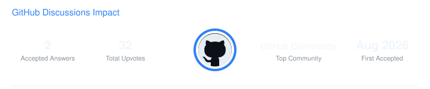

# AnswerTrace

GitHub Discussions contribution analytics and customizable SVG widgets for developer READMEs.

AnswerTrace analyzes public GitHub Discussions activity and turns it into a lightweight, automatically updated profile widget.

Built with **Python**, the **GitHub GraphQL API**, and **GitHub Actions**.

<p align="center">
  
</p>

## Metrics

AnswerTrace currently tracks:

- **Accepted Answers** — Discussion replies selected as the accepted answer.
- **Total Upvotes** — Total upvotes received across your GitHub Discussion comments.
- **Top Community** — Repository where you participated in the most distinct Discussions.
- **First Accepted** — Date of your earliest accepted Discussion answer.

## CLI Usage

Analyze a GitHub user:

```bash
answertrace USERNAME
```

Example:

```bash
answertrace antonisloukis
```

Generate an SVG widget:

```bash
answertrace antonisloukis --svg
```

Choose a custom output path:

```bash
answertrace antonisloukis \
  --svg \
  --output assets/discussion-impact.svg
```

Customize the accent color:

```bash
answertrace antonisloukis \
  --svg \
  --accent "#2F81F7"
```

## GitHub Action

AnswerTrace can generate and update the widget automatically through GitHub Actions.

```yaml
- name: Generate AnswerTrace widget
  uses: antonisloukis/answertrace@v1
  with:
    username: YOUR_GITHUB_USERNAME
    token: ${{ secrets.ANSWERTRACE_TOKEN }}
    output: assets/discussion-impact.svg
    accent: "#2F81F7"
```

### Authentication

Create a read-only GitHub token and save it as a repository Actions secret named:

```text
ANSWERTRACE_TOKEN
```

Never place your token directly inside your workflow, README, or source code.

## Automatic Updates

Create the following workflow in your profile or project repository:

```text
.github/workflows/answertrace.yml
```

Then add:

```yaml
name: Update AnswerTrace

on:
  workflow_dispatch:

  schedule:
    - cron: "17 4 * * *"

permissions:
  contents: write

jobs:
  answertrace:
    runs-on: ubuntu-latest

    steps:
      - name: Checkout repository
        uses: actions/checkout@v7

      - name: Generate AnswerTrace widget
        uses: antonisloukis/answertrace@v1
        with:
          username: YOUR_GITHUB_USERNAME
          token: ${{ secrets.ANSWERTRACE_TOKEN }}
          output: assets/discussion-impact.svg
          accent: "#2F81F7"

      - name: Commit updated widget
        shell: bash
        run: |
          if git diff --quiet -- assets/discussion-impact.svg; then
            echo "Widget is already up to date."
            exit 0
          fi

          git config user.name "github-actions[bot]"
          git config user.email "41898282+github-actions[bot]@users.noreply.github.com"

          git add assets/discussion-impact.svg
          git commit -m "chore: update AnswerTrace widget"
          git push
```

This workflow can be run manually and also refreshes the widget automatically on a schedule.

## Add the Widget to a README

Once AnswerTrace generates the SVG, display it with:

```html
<p align="center">
  
</p>
```

## Customization

The default AnswerTrace accent is:

```text
#2F81F7
```

You can choose another hexadecimal color:

```yaml
with:
  username: YOUR_GITHUB_USERNAME
  token: ${{ secrets.ANSWERTRACE_TOKEN }}
  output: assets/discussion-impact.svg
  accent: "#A371F7"
```

For example:

```text
Blue    #2F81F7
Purple  #A371F7
Green   #3FB950
Orange  #D29922
Red     #F85149
```

## Development

Clone AnswerTrace:

```bash
git clone https://github.com/antonisloukis/answertrace.git
cd answertrace
```

Create a virtual environment:

```bash
python3 -m venv .venv
```

Activate it on Linux or WSL:

```bash
source .venv/bin/activate
```

Install AnswerTrace in editable mode:

```bash
python -m pip install -e .
```

Check the CLI:

```bash
answertrace --help
```

Check the version:

```bash
answertrace --version
```

Analyze a user:

```bash
answertrace antonisloukis
```

Generate a widget:

```bash
answertrace antonisloukis --svg
```

## Testing

Run the full test suite:

```bash
python -m unittest discover -s tests -v
```

AnswerTrace also uses GitHub Actions CI to automatically run tests on pushes and pull requests to `main`.

## Project Structure

```text
answertrace/
├── .github/
│   └── workflows/
│       ├── ci.yml
│       └── update-widget.yml
│
├── assets/
│   └── discussion-impact.svg
│
├── src/
│   └── answertrace/
│       ├── __init__.py
│       ├── cli.py
│       ├── github.py
│       ├── metrics.py
│       ├── models.py
│       └── svg.py
│
├── tests/
│   ├── __init__.py
│   ├── test_metrics.py
│   └── test_svg.py
│
├── action.yml
├── pyproject.toml
├── LICENSE
└── README.md
```

## How It Works

```text
GitHub GraphQL API
        │
        ▼
Discussion activity
        │
        ▼
AnswerTrace
        │
        ├── Accepted Answers
        ├── Total Upvotes
        ├── Top Community
        └── First Accepted
        │
        ▼
SVG Widget
        │
        ▼
GitHub README
```

AnswerTrace handles paginated GitHub GraphQL results so accounts with larger Discussion histories can still be analyzed.

## Privacy & Security

AnswerTrace reads GitHub Discussions activity through the GitHub API.

It does not require authentication tokens to be stored in source code.

For GitHub Actions, tokens should always be provided through encrypted repository secrets such as:

```text
ANSWERTRACE_TOKEN
```

Use the minimum permissions required for your token.

## Contributing

Contributions, bug reports, and feature suggestions are welcome.

If you would like to contribute:

1. Fork the repository.
2. Create a new branch.
3. Make your changes.
4. Run the test suite.
5. Open a pull request.

## License

AnswerTrace is released under the **MIT License**.

See [`LICENSE`](./LICENSE) for details.